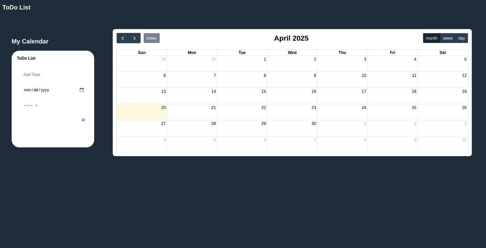
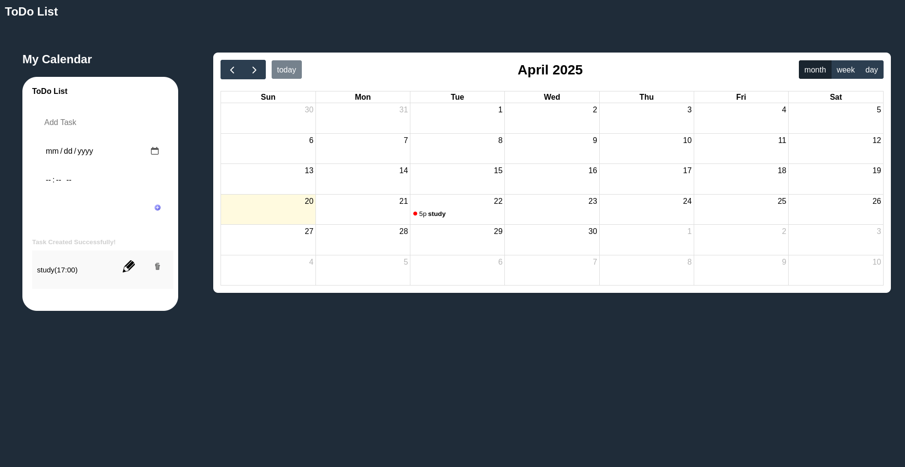
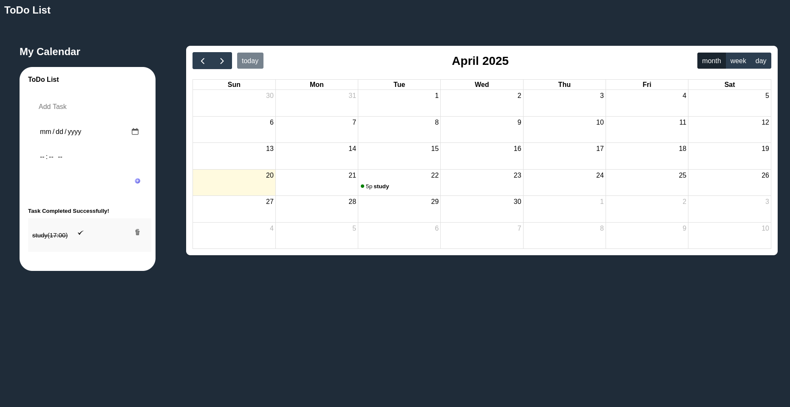

# **ToDo List**

Welcome to the **ToDo List** web application! This app helps you organize your day by adding tasks and attaching them to a calendar for better planning and productivity.

---

## **Features**
- Add tasks with specific dates and times.
- Edit or delete tasks easily.
- Mark tasks as completed, with visual indicators.
- View tasks on an interactive calendar.
- Responsive design for desktop and mobile.

---

## **Screenshots**
### **1. Start Screen**


### **2. Create Task**


### **3. Completed Task**


---

## **How to Use**
1. **Add a Task**:
   - Enter the task name, select a date and time, and click the "+" button.
2. **Edit a Task**:
   - Click the pencil icon next to a task to edit it.
3. **Delete a Task**:
   - Click the trash icon to remove a task.
4. **Mark as Completed**:
   - Double-click a task to mark it as completed (turns green on the calendar).

---

## **Task and Calendar Indicators**
### **Tasks Map**:
- 🖉 Pencil: Edit a task.
- 🗑️ Trash: Delete a task.

### **Calendar Map**:
- 🔴 Red: Uncompleted task.
- 🟢 Green: Completed task.

---

## **Languages and Dependencies**
This web application is built using:
- **HTML/CSS** for structure and styling.
- **JavaScript** for functionality.
- **FullCalendar** library for calendar integration.

--- 

## **Installation Guide**

### **1. Using Node.js**
- **Windows/Mac/Linux**:
  1. Download Node.js from [https://nodejs.org](https://nodejs.org).
  2. Install it using the installer.
  3. Verify installation:
     ```bash
     node -v
     npm -v
     ```

### **2. Using a Browser**
- **Steps**:
  1. Open any modern browser (e.g., Chrome, Firefox).
  2. Use the browser's Developer Tools:
     - Press `F12` or `Ctrl+Shift+I` (Windows/Linux) or `Cmd+Option+I` (Mac).
     - Navigate to the "Console" tab to run JavaScript directly.


## **Contributing**
Feel free to fork this repository and submit pull requests for improvements or new features.

---